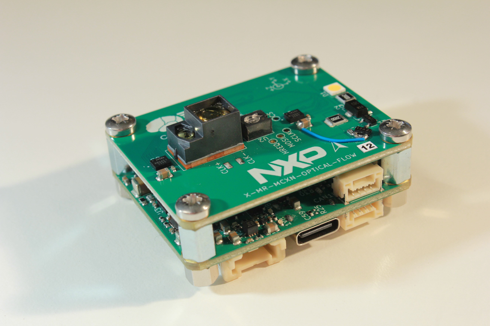
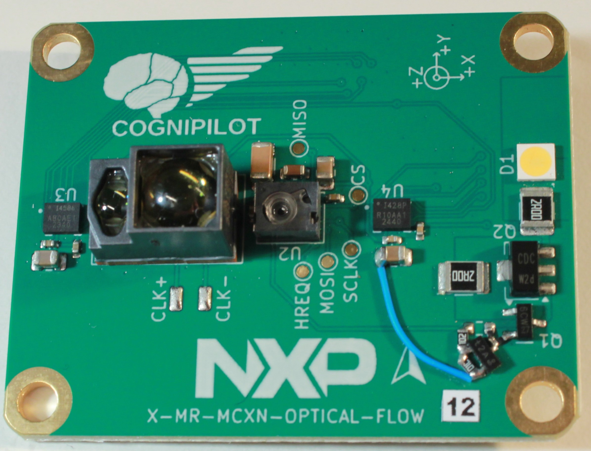
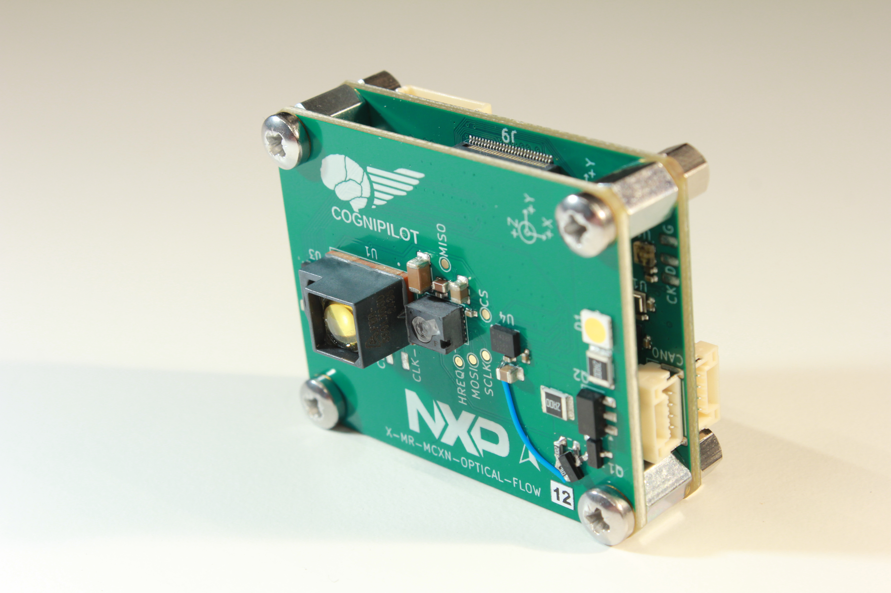
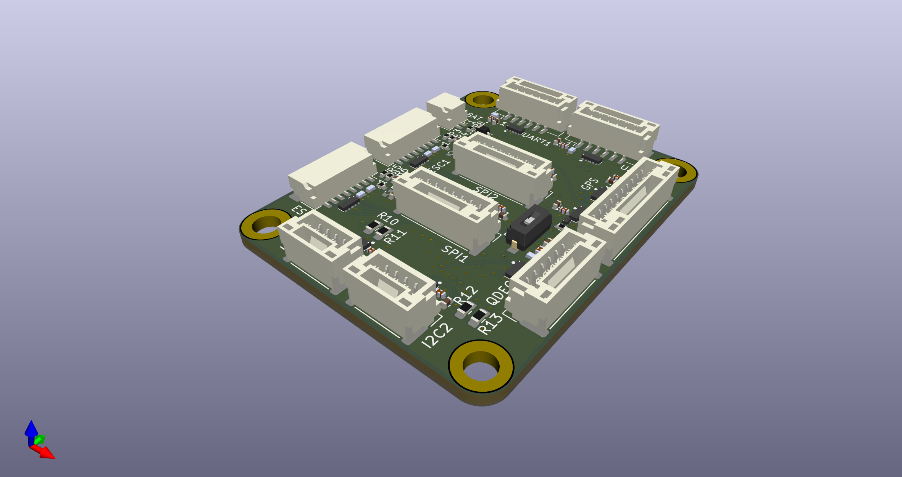
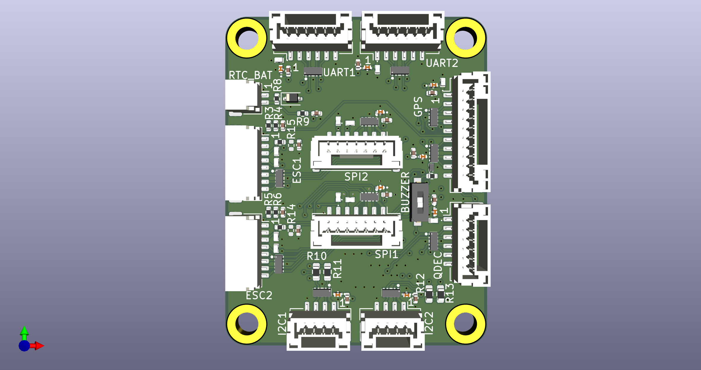

# MR-MCXN-T1 Add-on boards

> [!NOTE]
> Different Add-on boards have been designed for the modular multi-purpose [MR-MCXN-T1 Hub](https://github.com/CogniPilot/spinali_mcxn_t1_hub). 
>
> The following add-on boards have been designed:
> - Optical Flow
> - IO
> - GNSS (with F9P module) [^1]
> 
> All add-on boards are designed with KiCAD.
>
> [^1]: GNSS add-on is still in the design process.

Example of Optical Flow add-on board stacked on MR-MCXN-T1 Hub

# MR-MCXN-T1 Optical Flow

> [!NOTE]
> The Optical Flow add-on board can be used in for instance UAVs and UGVs for localization and navigation using the following on-board sensors:
> - Time of Flight (AFBR-S50LX85D)
> - Optical Flow (PAA3905E1) + required light source
> - IMU 2x (ICM-45686 & ICM42688)

MR-MCXN-T1 Optical Flow pictures

  

# MR-MCXN-T1 IO

> [!Note]
> MR-MCXN-T1 IO board brings out almost all GPIO to JST connectors. These are as follows:
> | IO type      | Connector type |
> | ----------- | ----------- |
> | UART 2x | JST GH 6-pin |
> | SPI 2x | JST GH 7-pin |
> | I2C 2x | JST GH 4-pin |
> | GPS | JST GH 10-pin |
> | Quadrature Decoder | JST GH 6-pin |
> | 4in1 ESC 2x | JST GH 8-pin |
> | External battery input for RTC | JST GH 2-pin |
> 
> If applicable the connector pinouts follow the [DS-009 Connector Standard](https://github.com/pixhawk/Pixhawk-Standards/blob/master/DS-009%20Pixhawk%20Connector%20Standard.pdf).

MR-MCXN-T1 IO pictures

  

